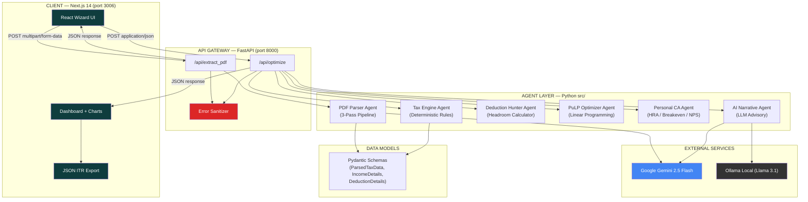
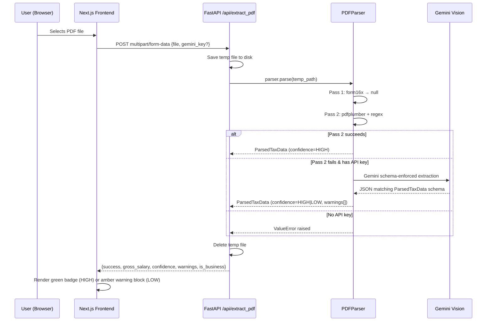
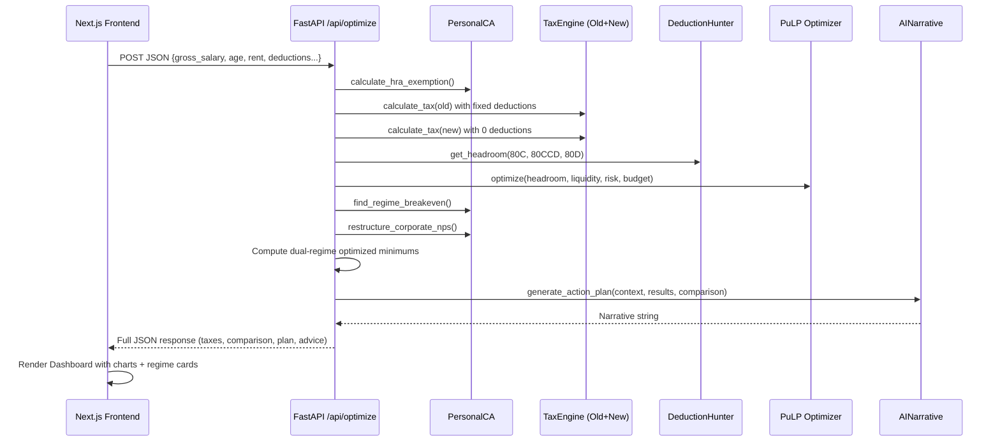

# Architecture Document — Hyper-Personalized AI Tax Optimizer

> **Version**: 1.0 · **Last Updated**: March 29, 2026  
> **Stack**: FastAPI (Python 3.11) · Next.js 14 (React/TypeScript) · PuLP · Gemini 2.5 Flash / Ollama Llama 3.1

---

## 1. High-Level System Diagram



---

## 2. Agent Roles & Responsibilities

### 2.1 PDF Parser Agent · `src/pdf_parser.py`

| Attribute | Detail |
|-----------|--------|
| **Role** | Extract structured financial data from uploaded Form 16 / salary slip PDFs |
| **Strategy** | Three-pass cascade with increasing intelligence |
| **Pass 1** | Structural `form16x` parser (standard Form 16 layouts) |
| **Pass 2** | `pdfplumber` + Regex fallback (scans for "Gross Salary" patterns) |
| **Pass 3** | Gemini 2.5 Flash Vision — Pydantic schema-enforced JSON extraction |
| **Output** | `ParsedTaxData` with `confidence` flag (`HIGH` / `LOW`) and `warnings[]` |
| **Error Handling** | If all 3 passes fail and no Gemini key → raises `ValueError` with user-facing message. Never leaks raw API traces. |

### 2.2 Tax Engine Agent · `src/tax_engine.py`

| Attribute | Detail |
|-----------|--------|
| **Role** | Deterministic, fully-owned Indian Income Tax computation |
| **Coverage** | FY 2024-25 and FY 2025-26 (Old + New regime slabs) |
| **Features** | Section 87A Rebate + Marginal Relief, Surcharge (10%/15%/25%/37%) with Marginal Relief, Conditional Standard Deduction (Salary vs Business), Age-based slab adjustment (Senior 60-79, Super Senior 80+), 4% Health & Education Cess |
| **Input** | `gross_income`, `deductions`, `is_salary_pension`, `age` |
| **Output** | Full breakdown dict: `base_tax`, `rebate_87a`, `marginal_relief`, `surcharge`, `cess`, `total_tax` |
| **Error Handling** | Raises `ValueError` on invalid FY/regime combinations. Pure math — no external calls. |

### 2.3 Deduction Hunter Agent · `src/deduction_hunter.py`

| Attribute | Detail |
|-----------|--------|
| **Role** | Tracks existing deductions and computes remaining "headroom" per section |
| **Sections** | 80C (₹1.5L), 80CCD(1B) (₹50K), 80CCD(2) (no cap), 80D (₹75K), 24(b) (₹2L) |
| **Key Methods** | `get_headroom()` — remaining investable capacity. `generate_audit_trail()` — transparent breakdown. `evaluate_tax_impact()` — simulates proposed investments. |
| **Regime Awareness** | Filters out sections invalid under New Regime (only 80CCD(2) passes through) |

### 2.4 PuLP Optimizer Agent · `src/optimizer.py`

| Attribute | Detail |
|-----------|--------|
| **Role** | Multi-objective linear programming to allocate capital optimally |
| **Solver** | PuLP CBC (Coin-or Branch and Cut) — runs locally, no external calls |
| **Objective** | Maximize: `TaxSaved × 0.5 + ExpectedReturn × 0.3 − LiquidityPenalty × 0.2` |
| **Constraints** | Section headroom limits, total budget cap, lock-in period ≤ user's liquidity horizon, risk score ≤ user's tolerance |
| **Instruments** | NPS Tier 1, VPF, ELSS MF, PPF, 5yr FD, Health Insurance |
| **Output** | `Dict[instrument_name → ₹ amount]` — exact allocation per instrument |

### 2.5 Personal CA Agent · `src/personal_ca.py`

| Attribute | Detail |
|-----------|--------|
| **Role** | Simulates a real Chartered Accountant's structural recommendations |
| **HRA Module** | Rule-of-3 optimization (`min(Actual HRA, 50%/40% Basic, Rent − 10% Basic)`) |
| **Breakeven** | Binary search (50 iterations) to find exact ₹ deductions needed for Old Regime superiority |
| **NPS Restructuring** | Recommends 80CCD(2) employer NPS shift (10% of Basic, tax-free in both regimes) |
| **Capital Gains** | ₹1.25L annual LTCG harvesting at 12.5% rate |

### 2.6 AI Narrative Agent · `src/ai_narrative.py`

| Attribute | Detail |
|-----------|--------|
| **Role** | Generates human-readable executive wealth advisory from optimization data |
| **Cloud Mode** | Gemini 2.5 Flash via `google-genai` SDK |
| **Privacy Mode** | Ollama Llama 3.1 via local HTTP (`localhost:11434`) |
| **Prompt** | Persona: "Elite Indian Executive Wealth Mentor." Ingests regime comparison matrix, headroom data, and optimization results. |
| **Timeout** | Ollama: 30s hard timeout |
| **Error Handling** | Cloud: returns "connect API or enable Ollama" message. Ollama: returns connection error string. Never leaks API keys or raw HTTP traces. |

---

## 3. Communication Flows

### 3.1 PDF Extraction Flow



### 3.2 Optimization Flow



---

## 4. Tool & Dependency Integrations

| Tool | Purpose | Integration Point |
|------|---------|-------------------|
| **PuLP (CBC Solver)** | Multi-objective tax-saving optimization | `src/optimizer.py` — runs locally, zero network calls |
| **pdfplumber** | PDF text extraction (Pass 2) | `src/pdf_parser.py` — page-by-page text extraction |
| **Google Gemini 2.5 Flash** | Vision-based PDF parsing (Pass 3) + AI narrative | `src/pdf_parser.py`, `src/ai_narrative.py` |
| **Ollama (Llama 3.1)** | Local privacy-first AI narrative | `src/ai_narrative.py` — HTTP to `localhost:11434` |
| **Pydantic v2** | Data validation + Gemini schema enforcement | `src/models.py` — shared across all agents |
| **FastAPI** | REST API gateway + CORS + error sanitization | `backend/main.py` |
| **Next.js 14** | React SSR frontend + Tailwind CSS | `frontend/` — wizard UI, dashboard, JSON export |
| **Recharts** | Interactive charts (Pie speedometer, stacked bar) | `frontend/src/components/Dashboard.tsx` |
| **Framer Motion** | Step transition animations | `frontend/src/app/page.tsx` |

---

## 5. Error-Handling Logic

### 5.1 Backend Error Sanitization (`backend/main.py`)

All exceptions from the optimization pipeline are caught at the API boundary and sanitized before reaching the client:

```
Exception caught
    ├── Contains "API key not valid" or "API_KEY_INVALID"
    │   └── HTTP 401: "Authentication Error: The provided Google Gemini API key is invalid."
    ├── Contains "quota" or "429"
    │   └── HTTP 429: "Rate Limit Exceeded: The provided Google Gemini API quota has been exhausted."
    └── Any other exception
        └── HTTP 500: "AI Engine Error: {first sentence only}"
```

> **Security Rule**: Raw Google RPC error payloads, stack traces, and API key metadata are **never** forwarded to the frontend. Only sanitized, human-readable messages are returned.

### 5.2 PDF Parser Resilience

```
Pass 1 (form16x) → null
    ↓
Pass 2 (pdfplumber + regex) → validates gross > 0
    ↓ (fail)
Pass 3 (Gemini Vision) → schema-enforced, allows LOW confidence
    ↓ (fail or no key)
ValueError → "Pass 1 and 2 failed, and no Gemini API key provided..."
```

- **TC3 (Gig Worker)**: Multi-source income (44ADA + salary) is captured via `total_gross_income` property. Income type auto-detected and toggled in the UI.  
- **TC4 (Corrupt PDF)**: Gemini is explicitly prompted to set `confidence: "LOW"` and populate `warnings[]`. The frontend renders an amber halt block until the user manually verifies the gross salary.

### 5.3 Frontend Error Boundaries

| Scenario | Handling |
|----------|----------|
| Backend unreachable | `catch` block → "Failed to connect to the backend API." |
| API returns `{success: false}` | Error banner displayed on Step 2, user stays on form |
| Dashboard receives incomplete data | Dashboard component renders diagnostic fallback card |
| Ollama not running | AI narrative returns explicit connection error string |

---

## 6. Data Flow Summary

```
┌──────────┐     ┌────────────┐     ┌─────────────────────────────────────────┐
│  PDF     │     │  User      │     │         OPTIMIZATION PIPELINE           │
│  Upload  │     │  Inputs    │     │                                         │
│          │     │            │     │  HRA ──► TaxEngine(old) ──► tax_old     │
│  Pass1   │     │ gross      │     │          TaxEngine(new) ──► tax_new     │
│  Pass2   │     │ rent/HRA   │     │                                         │
│  Pass3   │     │ age        │     │  DeductionHunter ──► headroom           │
│          │     │ metro      │     │  PuLP Optimizer ──► allocations         │
│  ▼       │     │ deductions │     │  PersonalCA ──► breakeven + NPS         │
│ gross_   │     │ risk/liq   │     │                                         │
│ salary   │     │            │     │  Dual-Regime Math ──► regime_comparison │
│ + conf.  │     │            │     │  AINarrative ──► executive advice       │
└────┬─────┘     └─────┬──────┘     └──────────────────┬──────────────────────┘
     │                 │                               │
     └────────► Frontend Wizard ◄──────────────────────┘
                    │
                    ▼
              Dashboard + Charts
              Export ITR JSON
```

---

## 7. Project File Structure

```
Hyper-Personalized-AI-Tax-Optimizer/
├── .agents/
│   └── ARCHITECTURE.md          ← This document
├── backend/
│   └── main.py                  ← FastAPI gateway (2 endpoints)
├── src/
│   ├── models.py                ← Pydantic schemas (ParsedTaxData, IncomeDetails)
│   ├── pdf_parser.py            ← 3-pass PDF extraction agent
│   ├── tax_engine.py            ← Deterministic tax rules engine
│   ├── deduction_hunter.py      ← Section headroom & audit trail
│   ├── optimizer.py             ← PuLP linear programming optimizer
│   ├── personal_ca.py           ← HRA, breakeven, NPS, LTCG agents
│   └── ai_narrative.py          ← Gemini / Ollama narrative generator
├── frontend/
│   └── src/
│       ├── app/
│       │   ├── page.tsx          ← 4-step wizard (Config → Profile → Loading → Dashboard)
│       │   ├── layout.tsx        ← Root layout + Google Fonts
│       │   └── globals.css       ← Tailwind + custom design tokens
│       └── components/
│           └── Dashboard.tsx     ← Dual-regime cards, charts, AI output
├── tests/
│   ├── test_tax_engine.py       ← 87A rebate + marginal relief edge cases
│   └── test_deduction_hunter.py ← Section limits + headroom verification
├── edge case files/
│   ├── TC1_standard_form16_clean.pdf
│   ├── TC2_87A_rebate_boundary.pdf
│   ├── TC3_gig_worker_multi_source.pdf
│   ├── TC4_missing_corrupt_fields.pdf
│   └── TC5_high_income_surcharge_old_regime.pdf
└── requirements.txt             ← fastapi, pulp, pdfplumber, google-genai, pydantic
```
