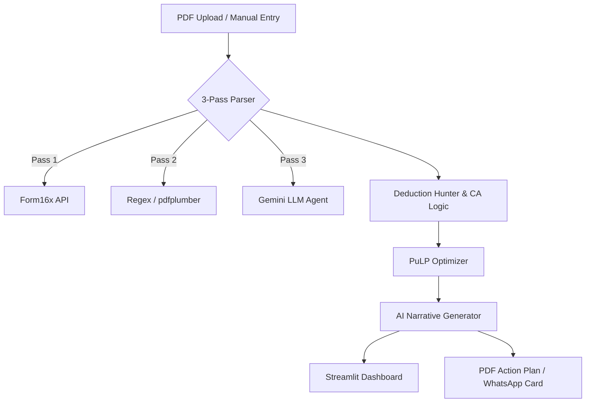

# 💡 Hyper-Personalized AI Tax Optimizer

> **Maximize your wealth with PuLP Optimization, AI-driven audit trails, and Advanced Personal CA heuristics.**

[](https://www.python.org/downloads/)
[](https://streamlit.io/)
[](https://coin-or.github.io/pulp/)

The **Hyper-Personalized AI Tax Optimizer** is a production-quality technical solution for navigating the complexities of the Indian Income Tax Act. Unlike generic calculators, it treats tax planning as a **multi-objective optimization problem**, balancing tax savings, investment returns, risk tolerance, and liquidity constraints.

---

## 🚀 Key Features

### 1. 📂 Three-Pass AI Parser
- **Pass 1:** Structural extraction for standard CBDT Form 16s (Part A & B).
- **Pass 2:** `pdfplumber` + Regex fallback for diverse salary slip formats.
- **Pass 3:** **LLM Field-Extraction Agent** (Gemini 2.5 Flash) with strict JSON Pydantic schemas for unrecognized or messy documents.
- **Validation:** Integrated checksums ensuring `Gross Salary = Sum(Components) ± 2%`.

### 2. ⚖️ Locally-Owned Tax Engine
- **No Unmaintained Dependencies:** Built a deterministic, FY-keyed rules module.
- **87A Special Logic:** Handles the tricky **Marginal Relief** for taxable income around the ₹12L nil-tax threshold (FY26 New Regime).
- **Full Coverage:** Dynamic support for Surcharges, Cess, and Section 87A rebates.

### 3. 🧠 Personal CA Advanced Heuristics
- **HRA Rule-of-3:** Exact optimization between Actual HRA, 50%/40% Basic, and Rent-10% Basic.
- **Regime Break-even:** Binary search algorithm to find the *exact ₹ amount* of deductions needed for the Old Regime to beat the New Regime.
- **Structural CTC Advice:** Corporate NPS (80CCD-2) restructuring (up to 10% Basic salary tax-free in BOTH regimes).
- **Capital Gains Harvesting:** Automated advice to harvest the ₹1.25L annual tax-free LTCG buffer (FY25 Budget).

### 4. 📈 PuLP Mathematical Optimizer
- Uses **Linear Programming** to rank and allocate your investment budget.
- **Hard Constraints:** Natively respects `liquidity_deadline` (e.g., won't suggest ELSS for 2-year goals) and `risk_tolerance`.

---

## 🛠️ Tech Stack

- **Frontend:** Streamlit (Custom Glassmorphism UI)
- **Optimization:** PuLP (COIN-OR Branch and Cut)
- **Parsing:** pdfplumber + Google Gemini 2.5 Flash
- **AI Narrative:** Gemini Flash (Cloud) / Ollama Llama 3.1 (Privacy Mode)
- **Reporting:** ReportLab (PDF) & WeasyPrint (Shareable Cards)
- **Testing:** Pytest

---

## 📦 Installation & Setup

1. **Clone the Repository:**
   ```bash
   git clone https://github.com/ayuhzkishan/Hyper-Personalized-AI-Tax-Optimizer.git
   cd Hyper-Personalized-AI-Tax-Optimizer
   ```

2. **Install Dependencies:**
   ```bash
   pip install -r requirements.txt
   ```

3. **Running the Dashboard:**
   ```bash
   streamlit run app.py
   ```

4. **Environment Configuration:**
   - Enter your **Gemini API Key** in the sidebar for AI-driven parsing and narrative generation.
   - Alternatively, toggle **"Privacy Mode"** to use a local Ollama instance (`llama3.1`).

---

## 🏗️ Architecture Overview



---

## ✅ Verification

Run the comprehensive test suite to verify tax engine accuracy:
```bash
pytest tests/
```

- `tests/test_tax_engine.py`: Verifies slab rates and 87A marginal relief.
- `tests/test_deduction_hunter.py`: Verifies exact headroom tracking.

---

## 📜 Portability & Maintenance

Indian tax slabs change every Budget day. To update for a new FY, simply modify the `TAX_RULES` dicitonary in `src/tax_engine.py`. **Zero library upgrades required.**

---

*Developed as a high-fidelity Personal CA simulation.*
